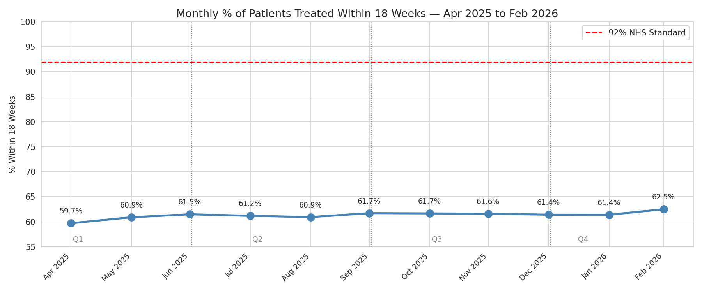
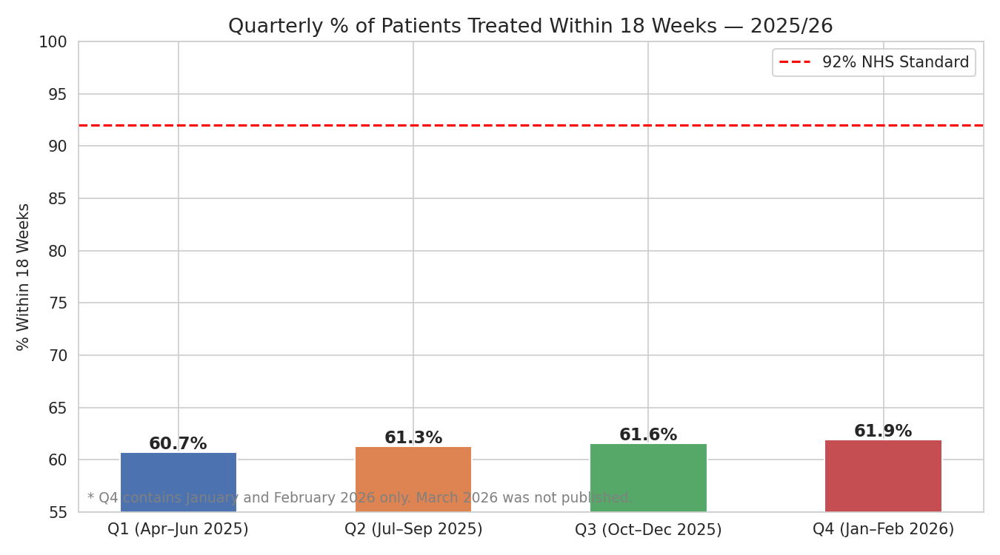
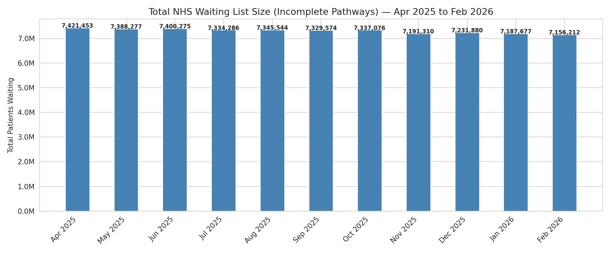
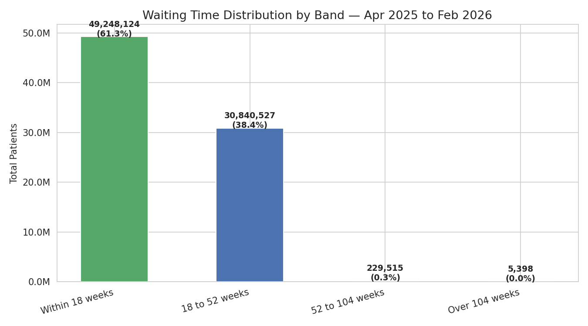
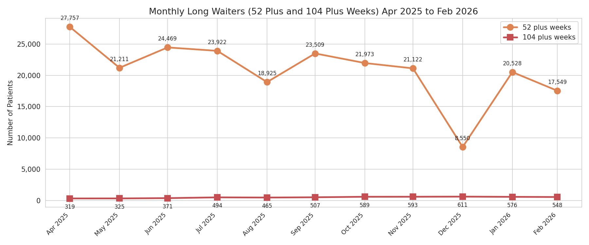
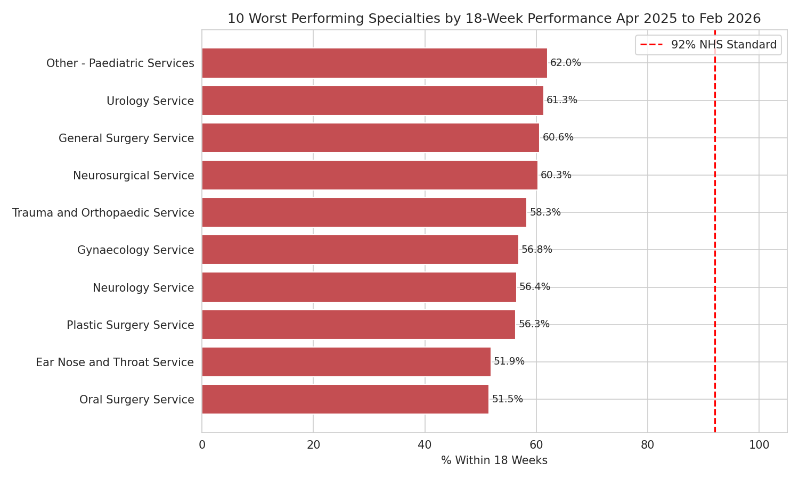
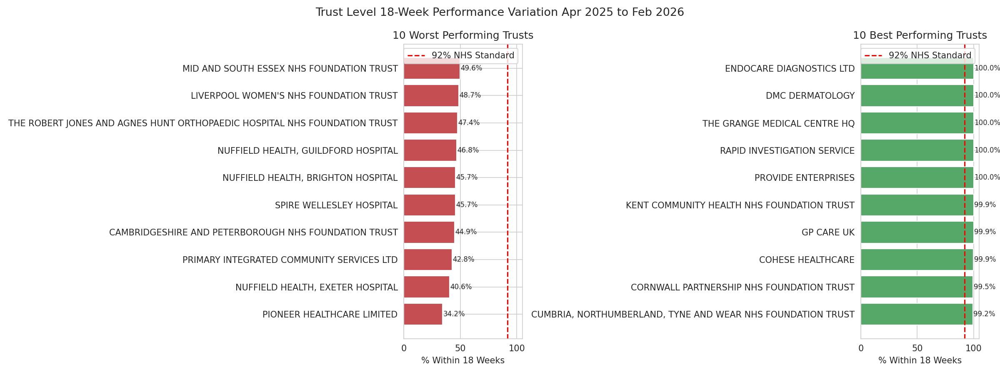
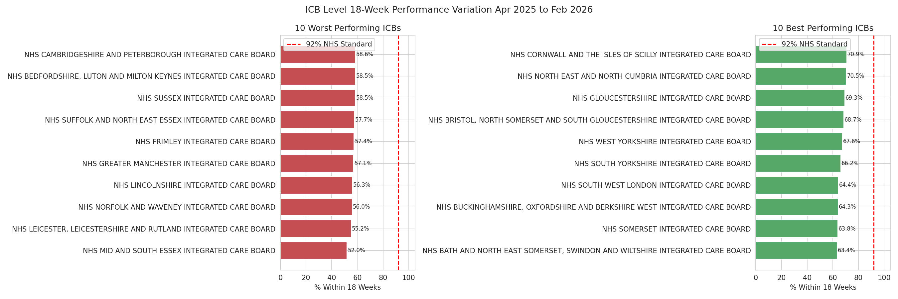
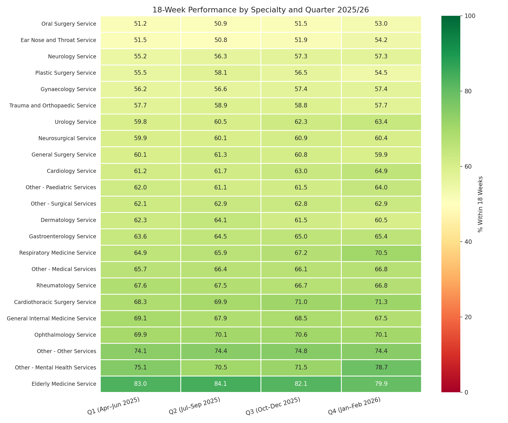

# NHS Referral to Treatment (RTT) Waiting Times
## Exploratory Data Analysis, SQL Analysis and Power BI Dashboard | Financial Year 2025/26

---

## Project Overview
This project examined NHS England Referral to Treatment (RTT) waiting times
across the 2025/26 financial year (April 2025 to February 2026). The analysis
covers all NHS trusts and providers submitting monthly RTT returns to NHS England.
It was conducted in three parts: an exploratory data analysis in Python producing
9 analytical visualisations, a SQL analysis in PostgreSQL producing 10 analytical
queries, and an interactive Power BI dashboard connecting directly to the PostgreSQL
database. March 2026 data had not been published at the time of this analysis and
was therefore excluded. Q4 figures reflect January and February 2026 only.

---

## Objectives
- Track national 18-week performance against the 92% NHS constitutional standard
- Assess quarterly performance trends across the 2025/26 financial year
- Quantify the total size of the NHS waiting list and monitor backlog reduction
- Examine the distribution of patients across waiting time bands
- Identify specialties with the greatest waiting time pressures
- Identify best and worst performing trusts by 18-week performance
- Analyse performance variation across Integrated Care Boards (ICBs)
- Track monthly trends in long waiters (52 plus and 104 plus weeks)
- Measure month on month change in national 18-week performance
- Present findings in an interactive Power BI dashboard

---

## Data Source
| | |
|---|---|
| **Publisher** | NHS England |
| **Dataset** | Consultant-led RTT Waiting Times 2025/26 |
| **Coverage** | Approximately 515 NHS trusts and providers per month across 23 treatment specialties |
| **Frequency** | Monthly |
| **Access** | [NHS England Statistics](https://www.england.nhs.uk/statistics/statistical-work-areas/rtt-waiting-times/) |

---

## Tools & Libraries
| Tool | Purpose |
|---|---|
| Python 3.12 | Core programming language |
| pandas | Data loading, cleaning and transformation |
| matplotlib | Chart production and formatting |
| seaborn | Chart styling and heatmap production |
| Jupyter Notebook | Interactive analysis environment |
| PostgreSQL 16 | Database and SQL query execution |
| psycopg2 | PostgreSQL database adapter for Python |
| sqlalchemy | Database connection engine |
| Power BI Desktop | Interactive dashboard and data visualisation |

---

## Key Findings
- The NHS missed the 92% 18-week standard in **every single reporting period**
- National performance ranged between **59.7% and 62.5%** across the year
- The overall waiting list reduced from **7.42 million** in April 2025 to
  **7.16 million** in February 2026 — a reduction of approximately 265,000 patients
- **62.6%** of all waiting time was within 18 weeks
- **37.1%** of patients were waiting between 18 and 52 weeks
- Performance improved steadily from **Q1 (60.7%)** to **Q4 (61.9%)**
- **Oral Surgery** was the worst performing specialty at just **51.5%**
- **NHS Mid and South Essex ICB** was the worst performing ICB at **52.0%**
- Long waiters of 52 plus weeks declined from **27,757** in April 2025 to
  **17,549** in February 2026

---

## Python Analysis
| Step | Description |
|---|---|
| 1. Load and Combine Data | 11 monthly CSV files loaded and concatenated |
| 2. Quarter Labels | NHS financial year quarters assigned |
| 3. Data Quality Assessment | Missing values and data types checked |
| 4. Data Cleaning | Weekly band nulls filled and commissioner fields standardised |
| 5. National Performance Trend | Monthly 18-week performance vs 92% standard |
| 6. Quarterly Performance Trend | Quarterly aggregation and bar chart |
| 7. Total Waiting List Size | Monthly backlog size trend |
| 8. Waiting Time Distribution | Patients grouped into four waiting time bands |
| 9. Long Waiters Analysis | Monthly trend of 52 plus and 104 plus week waiters |
| 10. Specialty Level Breakdown | 10 worst performing specialties |
| 11. Trust Level Variation | 10 best and worst performing trusts |
| 12. Commissioner Level Analysis | 10 best and worst performing ICBs |
| 13. Heatmap | 18-week performance by specialty and quarter |
| 14. Summary Insights | Key findings and conclusions |
| 15. PostgreSQL Export | Pre-aggregated summary tables exported for Power BI |

---

## SQL Queries
| Query | Description |
|---|---|
| 1. National Performance by Month | Monthly 18-week performance vs 92% standard |
| 2. Quarterly Performance Trend | Quarterly aggregation across 2025/26 |
| 3. Total Waiting List Size | Monthly backlog size trend |
| 4. Ten Worst Performing Specialties | Specialties with lowest 18-week performance |
| 5. Ten Worst Performing Trusts | Trusts with lowest 18-week performance |
| 6. Ten Best Performing Trusts | Trusts with highest 18-week performance |
| 7. Long Waiters by Month | Monthly trend of 52 plus and 104 plus week waiters |
| 8. Ten Worst Performing ICBs | ICBs with lowest 18-week performance |
| 9. Performance Gap to 92% Target | Gap between specialty performance and 92% standard |
| 10. Month on Month Performance Change | Monthly change using LAG window function |

---

## Power BI Dashboard
An interactive dashboard was built in Power BI Desktop connecting directly
to the PostgreSQL database. The dashboard presents key findings across two
pages covering national performance trends, quarterly aggregations, specialty
and trust level variation, long waiter trends and ICB level analysis.

| Visual | Description |
|---|---|
| 1. Waiting List Size (Feb 2026) | Latest monthly waiting list size |
| 2. Overall 18-Week Performance | National performance across 2025/26 |
| 3. Avg Monthly 52+ Week Waiters | Average monthly long waiters |
| 4. Avg Monthly 104+ Week Waiters | Average monthly very long waiters |
| 5. Monthly Performance Trend | Monthly 18-week performance vs 92% standard |
| 6. Quarterly Performance Trend | Quarterly aggregation across 2025/26 |
| 7. Top 10 Worst Specialties | Specialties with lowest 18-week performance |
| 8. Top 10 Worst Trusts | Trusts with lowest 18-week performance |
| 9. Monthly Long Waiters | Monthly trend of 52 plus and 104 plus week waiters |
| 10. Top 10 Worst ICBs | ICBs with lowest 18-week performance |

---

## How to Run

### Prerequisites
- Python 3.8 or higher
- PostgreSQL 14 or higher
- Power BI Desktop (free) — https://powerbi.microsoft.com/desktop
- Jupyter Notebook

---

### 1. Clone the Repository
```bash
git clone https://github.com/Kingsley-Eboh/nhs-rtt-analysis.git
cd nhs-rtt-analysis
```

---

### 2. Install Dependencies
```bash
pip install pandas matplotlib seaborn sqlalchemy psycopg2-binary jupyter
```

---

### 3. Download the Data
Download the monthly RTT full extract CSV files from NHS England for each
month from April 2025 to February 2026 and place them in the `data/` folder:

https://www.england.nhs.uk/statistics/statistical-work-areas/rtt-waiting-times/

Look for the **Consultant-led Referral to Treatment Waiting Times** section
and download the full provider-level extract for each month.

---

### 4. Run the Python Analysis
Launch Jupyter Notebook and open `notebooks/nhs_rtt_analysis.ipynb`:

```bash
jupyter notebook
```

Select **Kernel → Restart and Run All** to execute all cells in sequence.
The final cell exports pre-aggregated summary tables to PostgreSQL for use
in the Power BI dashboard.

---

### 5. Set Up PostgreSQL
Create a local PostgreSQL database and user with the appropriate privileges.
Update the connection string in the notebook's final cell to match your
local database configuration before running the export step.

Refer to the official PostgreSQL documentation for setup guidance:
https://www.postgresql.org/docs/

---

### 6. Run the SQL Queries
Once the database is populated execute the analytical queries:

```bash
psql -U <your_user> -d <your_database> -h localhost -f sql/nhs_rtt_analysis.sql
```

---

### 7. Open the Power BI Dashboard
Open `powerbi/nhs_rtt_dashboard.pbix` in Power BI Desktop and reconnect
to your local PostgreSQL instance using your configured credentials when prompted.

To view the dashboard without any local setup open the exported PDF:
`powerbi/nhs_rtt_dashboard.pdf`

---

## Project Structure
```
nhs-rtt-analysis/
├── notebooks/
│   └── nhs_rtt_analysis.ipynb         # Main analysis notebook
├── figures/
│   ├── monthly_trend.png              # Monthly performance trend
│   ├── quarterly_trend.png            # Quarterly performance trend
│   ├── backlog_size.png               # Total waiting list size
│   ├── wait_distribution.png          # Waiting time distribution
│   ├── long_waiters.png               # Long waiters trend
│   ├── specialty_breakdown.png        # Specialty level breakdown
│   ├── trust_variation.png            # Trust level variation
│   ├── icb_variation.png              # ICB level variation
│   └── heatmap_specialty_quarter.png  # Heatmap by specialty and quarter
├── sql/
│   └── nhs_rtt_analysis.sql           # All 10 SQL queries with comments
├── powerbi/
│   ├── nhs_rtt_dashboard.pbix         # Power BI Desktop dashboard file
│   └── nhs_rtt_dashboard.pdf          # Exported PDF of the dashboard
├── .gitignore                         # Excludes data files and checkpoints
└── README.md                          # Project documentation
```
---

## Evidence

### Step 5 — Monthly Performance Trend
[](figures/monthly_trend.png)

### Step 6 — Quarterly Performance Trend
[](figures/quarterly_trend.png)

### Step 7 — Total Waiting List Size
[](figures/backlog_size.png)

### Step 8 — Waiting Time Distribution
[](figures/wait_distribution.png)

### Step 9 — Long Waiters Analysis
[](figures/long_waiters.png)

### Step 10 — Specialty Level Breakdown
[](figures/specialty_breakdown.png)

### Step 11 — Trust Level Variation
[](figures/trust_variation.png)

### Step 12 — Commissioner Level Analysis
[](figures/icb_variation.png)

### Step 13 — Heatmap by Specialty and Quarter
[](figures/heatmap_specialty_quarter.png)

---

## Author
**Kingsley Eboh**
[GitHub](https://github.com/Kingsley-Eboh)

---

*Data sourced from NHS England. This project is intended for portfolio and
educational purposes.*
